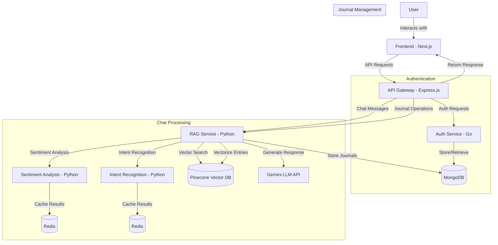
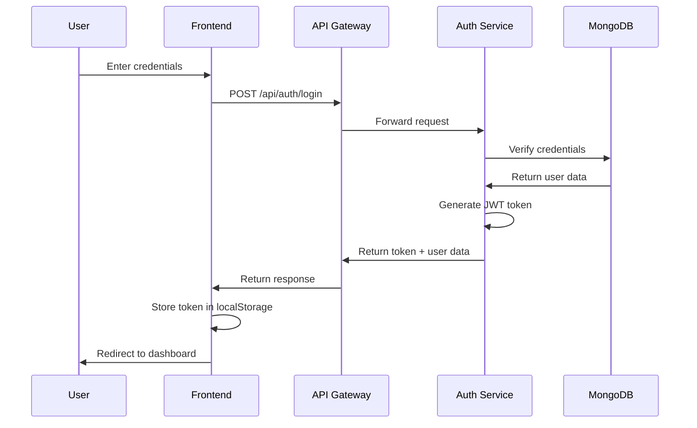
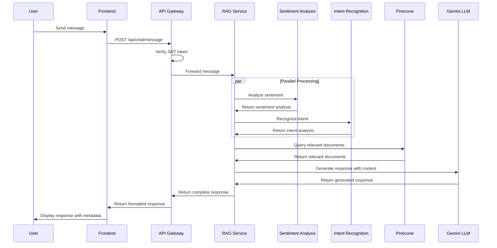
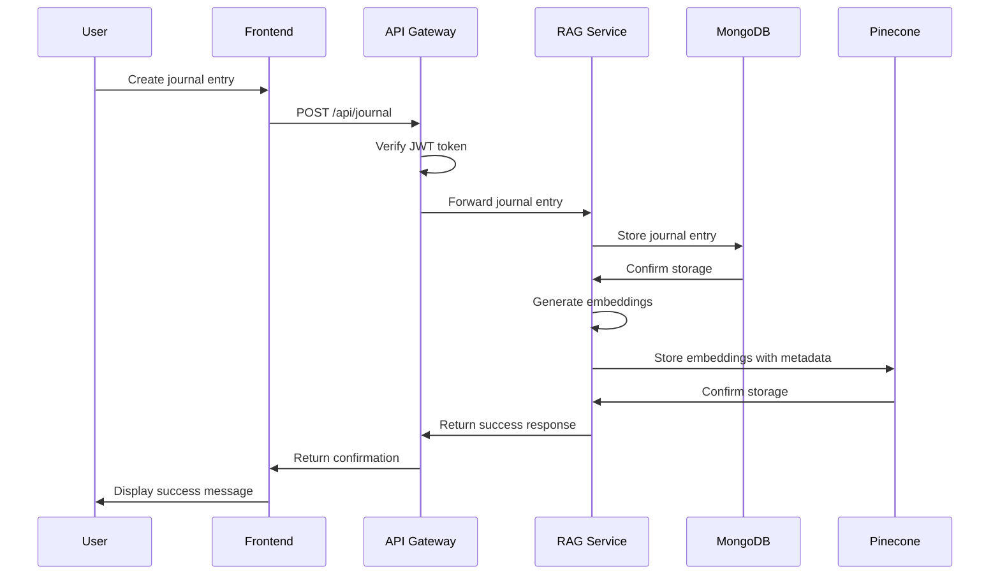
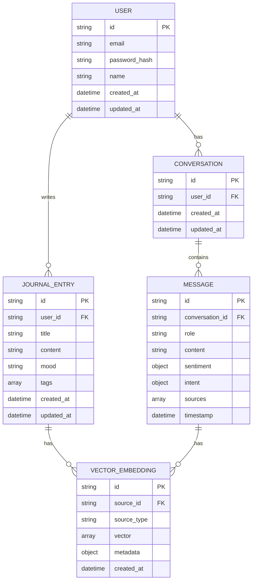
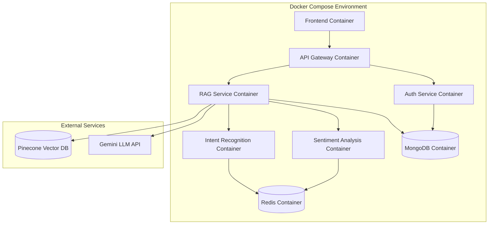
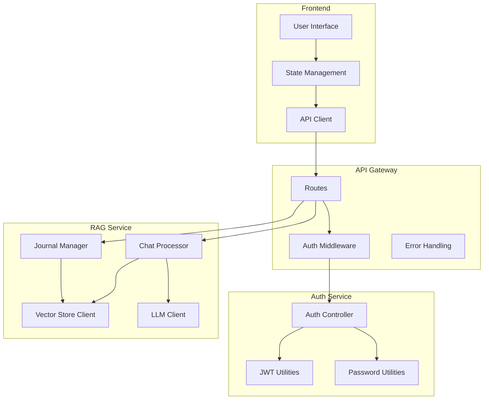

# MentalBloom Architecture Diagrams

## System Architecture Diagram

## Authentication Flow

## Chat Message Flow

## Journal Entry Flow

## Data Model

## Deployment Architecture

## Component Interaction Diagram

These diagrams provide a comprehensive visual representation of the MentalBloom architecture, showing the system components, their interactions, data flow, and deployment structure.
